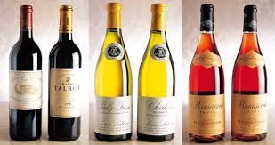

# 타이타닉
<!-- <pre><code><pre/><code/>안에 코드를 넣으면 된다 -->
| 주제 |이미지를 누르면 데이터를 다운로드하는 곳으로 이동합니다.| 코드주소 |
|------|-----|----------|
|타이타닉|<a href="https://www.kaggle.com/c/titanic/data" target="_blank">|[기본 예제](https://github.com/kwong3528/Python/blob/master/%ED%83%80%EC%9D%B4%ED%83%80%EB%8B%89/%ED%83%80%EC%9D%B4%ED%83%80%EB%8B%89.ipynb),        [앙상블 기법을 이용](https://github.com/kwong3528/Python/blob/master/%ED%83%80%EC%9D%B4%ED%83%80%EB%8B%89/%ED%83%80%EC%9D%B4%ED%83%80%EB%8B%89%20%EC%95%99%EC%83%81%EB%B8%94.ipynb)|

#### 캐글 타이타닉을 이미 진행하신분들의 코드를 필사하며 공부를 하였다.
--------------------------------------------------------------
# 와인퀄리티 분류
<!-- <pre><code><pre/><code/>안에 코드를 넣으면 된다 -->
| 주제 |이미지를 누르면 데이터를 다운로드하는 곳으로 이동합니다.| 코드주소 |
|------|-----|----------|
|와인분류|<a href="https://archive.ics.uci.edu/ml/machine-learning-databases/wine-quality/" target="_blank">|[기본 예제](https://github.com/kwong3528/Kaggle-practice/blob/master/%EC%99%80%EC%9D%B8%ED%80%84%EB%A6%AC%ED%8B%B0%EB%B6%84%EB%A5%98/wine-quality.ipynb)|

입력 변수(물리화학 테스트 기준):
1 - 고정산도
2 - 휘발성 산도
3 - 구연산
4 - 잔당
5 - 염소산염
6 - 무연 이산화황
7 - 총 아황산가스
8 - 밀도
9 - pH
10 - 황산염
11 - 알코올
출력 변수(센서 데이터에 기반):
12 - 품질 (0~10점)

#### 기존의 와인 퀄리티 분류문제에 여러모델을 적용해보았다.
#### 랜덤포레스트의 정확도가 가장 높게나왔다.
 
